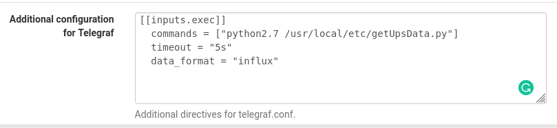

UPS
===

### Linux

A python script that provides output data for UPS devices.

**Original Git repo:** https://github.com/sa7mon/ups-telegraf

Example output:

```
ups battery.charge=100,battery.charge.low=30,battery.charge.warning=20,battery.mfr.date=CPS,battery.runtime=517,battery.runtime.low=300,battery.type=PbAcid,battery.voltage=14.2,battery.voltage.nominal=12,device.mfr=CPS,device.type=ups,driver.parameter.bus=002,driver.parameter.lowbatt=30,driver.parameter.offdelay=90,driver.parameter.ondelay=50,driver.parameter.pollfreq=30,driver.parameter.pollinterval=2,driver.parameter.port=auto,driver.parameter.productid=0501,driver.parameter.synchronous=no,driver.parameter.vendor=CPS,driver.parameter.vendorid=0764,driver.version.internal=0.41,input.transfer.high=140,input.transfer.low=96,input.voltage=116.0,input.voltage.nominal=0,output.voltage=116.0,ups.beeper.status=enabled,ups.delay.shutdown=90,ups.delay.start=50,ups.load=57,ups.mfr=CPS,ups.productid=0501,ups.realpower.nominal=375,ups.status=OL,ups.timer.shutdown=-60,ups.timer.start=-60,ups.vendorid=0764
```

Customization
---

You can customize the data that you want to use by running `uspc [ups name]` and seeing what outputs your UPS gives. For example:

```
# upsc CyberPowerSL700U | awk -F":" '{print $1}'
battery.charge
battery.charge.low
battery.charge.warning
battery.mfr.date
battery.runtime
battery.runtime.low
battery.type
battery.voltage
battery.voltage.nominal
device.mfr
device.model
device.type
driver.name
driver.parameter.bus
driver.parameter.lowbatt
driver.parameter.offdelay
driver.parameter.ondelay
driver.parameter.pollfreq
driver.parameter.pollinterval
driver.parameter.port
driver.parameter.product
driver.parameter.productid
driver.parameter.synchronous
driver.parameter.vendor
driver.parameter.vendorid
driver.version
driver.version.data
driver.version.internal
input.transfer.high
input.transfer.low
input.voltage
input.voltage.nominal
output.voltage
ups.beeper.status
ups.delay.shutdown
ups.delay.start
ups.load
ups.mfr
ups.model
ups.productid
ups.realpower.nominal
ups.status
ups.timer.shutdown
ups.timer.start
ups.vendorid
```

Then add/remove fields in the `string_measurements` variable in [getUpsData.py](./getUpsData.py).

On my pfSense for example, I only output `battery.charge`, `ups.status` and `battery.runtime`

```
'string_measurements=["battery.charge","ups.status","battery.runtime"]
```

Configuration
---

### Linux

a. Download [getUpsData.py](./getUpsData.py) to`/usr/local/bin/getUpsData.py`

b. Add the configuration to the `/etc/telegraf/telegraf.conf`

```
[[inputs.exec]]
  commands = ["python /usr/local/bin/getUpsData.py"]                                              
  timeout = "5s"
  data_format = "influx"
```

c. Restart telegraf service

```
systemctl restart telegraf.service
```

### pfSense

a. Download [getUpsData.py](./getUpsData.py) to `/usr/local/etc/getUpsData.py`

b. Add the configuration to the `telegraf` service

```
[[inputs.exec]]
  commands = ["python2.7 /usr/local/etc/getUpsData.py"]
  timeout = "5s"
  data_format = "influx"
```


